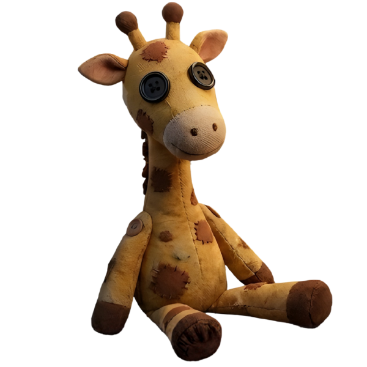
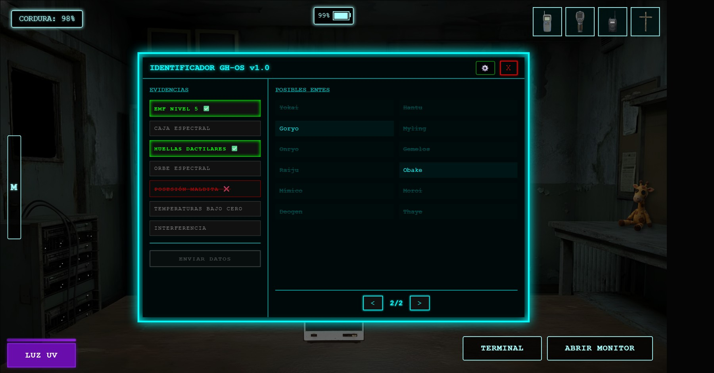
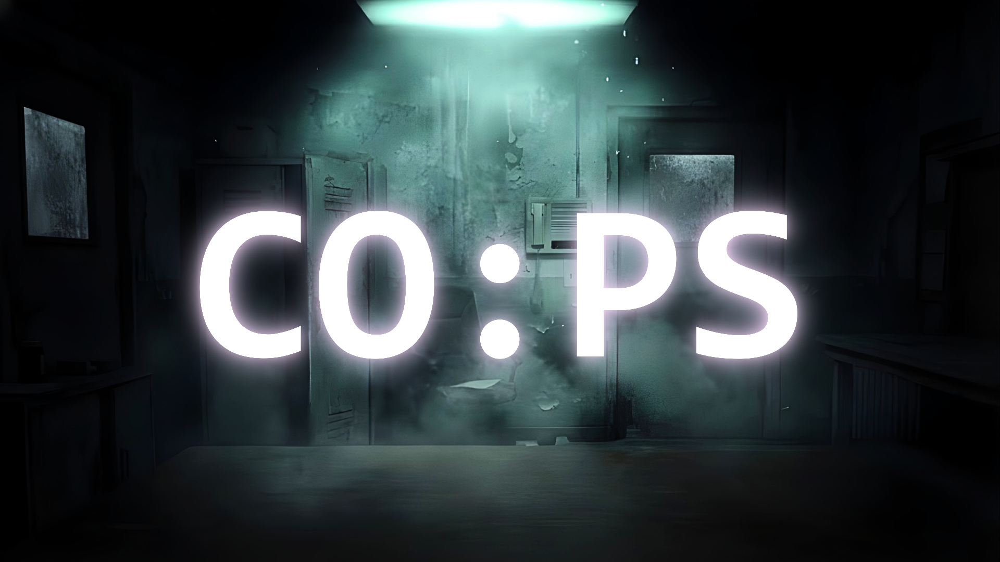

# Esencia de COPS

## Inspiraciones detrás de *Contención: Psiquiátrico (COPS)*

Hola a todos. Bienvenidos al segundo devlog de **Contención: Psiquiátrico (COPS)**.
En esta entrada quiero hablar de algo clave en el desarrollo del proyecto: **las ideas y enfoques de diseño que sirvieron como punto de partida**, y cómo se transformaron en una experiencia propia.

La idea nació de forma espontánea durante una noche de juegos con mi pareja. Tras pasar horas inmersos en diferentes títulos, me surgió una pregunta: ¿cómo sería una experiencia que mezclara la tensión de esos mundos con mecánicas de otros géneros?

A partir de esa duda, el objetivo se volvió claro: **combinar dos aproximaciones al terror** que trabajan la tensión de formas muy distintas, fusionándolas en un entorno opresivo y psicológico.

### El escenario: un psiquiátrico olvidado
La experiencia de COPS gira alrededor de la **tensión constante y la vulnerabilidad**.
Aquí no encarnas a un cazador de fantasmas preparado ni a un soldado armado. Eres un guardia o investigador atrapado en un entorno hostil, donde el silencio, la oscuridad y la información incompleta son tus mayores amenazas.

El miedo no proviene solo de lo que ves, sino de lo que **no puedes controlar**.

### Gestión de recursos y supervivencia bajo presión
Uno de los pilares del diseño es la **administración cuidadosa de recursos** y la sensación permanente de estar al límite. Este enfoque se inspira en el terror de supervivencia nocturna popularizado por obras de Scott Cawthon, pero reinterpretado dentro de nuestro propio contexto.

* **Monitoreo del entorno**
El jugador depende de sistemas de vigilancia para observar pasillos y áreas críticas del psiquiátrico, anticipando peligros antes de que sea demasiado tarde.

* **Administración de energía**
La batería es un recurso finito. Cada herramienta utilizada implica una decisión, y cada error reduce tus posibilidades de llegar al amanecer.

* **Movilidad limitada**
No siempre es posible huir. La falta de libertad de movimiento refuerza la claustrofobia y obliga a pensar de forma estratégica en lugar de reaccionar por instinto.

### Investigación paranormal e incertidumbre psicológica
El segundo gran eje del juego se apoya en la **investigación de fenómenos paranormales**, donde la información es fragmentada y el peligro nunca es del todo visible. Este enfoque toma inspiración de juegos modernos de investigación cooperativa, adaptándolo a una experiencia más solitaria e introspectiva.

* **Herramientas de detección**
El jugador cuenta con dispositivos diseñados para detectar e interactuar con presencias anómalas, interpretando señales ambiguas en lugar de certezas absolutas.

* **Análisis del entorno**
Elementos como rastros invisibles, cambios sutiles en el ambiente o reacciones inesperadas ayudan a reconstruir qué tipo de entidad acecha el lugar.

* **Estado mental del personaje**
La mente del protagonista es frágil. La exposición prolongada a la oscuridad o a eventos paranormales afecta la percepción, distorsionando sonidos, imágenes y decisiones.

### Una identidad propia
Lo que define a **COPS** no es la suma de sus influencias, sino **la forma en que estas se cruzan**.
El jugador debe investigar y comprender la amenaza mientras gestiona recursos limitados y sobrevive a la noche, creando una experiencia donde el conocimiento y la resistencia mental son tan importantes como la estrategia.

Este devlog es solo el inicio. En las próximas entradas profundizaremos en el diseño de sistemas, decisiones técnicas y los desafíos de trasladar estas ideas al código.

Gracias por acompañarme en este proceso.
