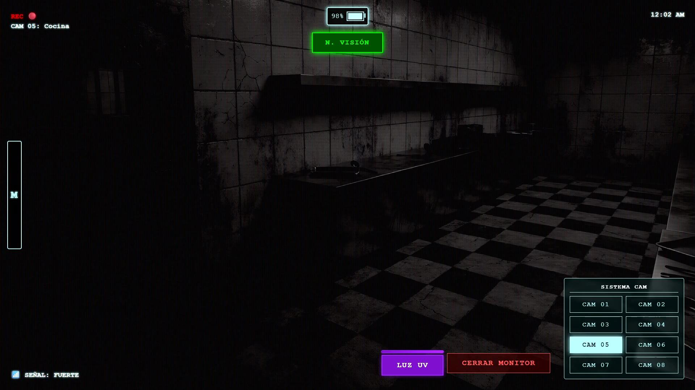

# UI / HUD

## Diseño de Interfaz en COPS: Horror a través del Monitor

Hola de nuevo. En esta tercera entrada quiero adentrarme en un aspecto que a menudo se pasa por alto pero que, en **Contención: Psiquiátrico**, es esencial para la experiencia: la interfaz de usuario (UI) y cómo interactuamos con el mundo del juego.

A diferencia de otros juegos donde la interfaz es un elemento flotante sobre la acción, aquí la interfaz **es** el juego.

    

### 1. La Estética "CRT": Tecnología Web para un Feeling Analógico

Cómo logramos esa textura de "monitor viejo" utilizando tecnologías web estándar? (HTML/CSS/Canvas). La respuesta no está en un solo filtro, sino en la superposición de varias capas de imperfección simulada.

Para lograr que una página web limpia se sienta como un monitor de tubo (CRT) de los 90s, trabajamos en tres frentes:

*   **Scanlines y Aberración Cromática**: Se utilizo CSS puro y superposiciones en Canvas para crear las clásicas líneas de barrido y la separación de colores (RGB) en los bordes de alto contraste.
*   **Curvatura y Viñetado**: Un sutil efecto de "ojo de pez" y oscurecimiento en las esquinas simula la geometría convexa de los monitores antiguos.
*   **Glow (Resplandor) del Fósforo**: Nada es perfectamente nítido en un CRT. Añadimos un leve desenfoque y resplandor ("bloom") a los textos y elementos verdes/ámbar para imitar la incandescencia del fósforo excitado.

    

### 2. UI Diegética: La Herramienta es el Juego

Un pilar fundamental de **COPS** es la **UI Diegética**.
Esto significa que los menús, botones y mapas que ves en pantalla no son abstracciones para el jugador (tú), sino que existen físicamente dentro del mundo del juego para el personaje (el guardia).

*   **Sin "Pausas" Reales**: Cuando abres el mapa o revisas el expediente, no estás pausando el tiempo. El personaje está mirando un documento o cambiando de pantalla en su terminal mientras el mundo sigue girando (y acechando) a su alrededor.
*   **El Menú como Sistema Operativo**: Toda la navegación imita un sistema operativo táctico real. Los tiempos de carga simulados, los sonidos de arranque de disco duro y los ruidos de "tecleo" refuerzan la idea de que estás operando una máquina.

    

### 3. El Diseño del Miedo: ¿Cómo hacer "Aterrador" un Excel?

El mayor desafío de diseño fue: ¿Cómo hacer que mirar una pantalla de computadora sea una experiencia tensa y no una tarea administrativa aburrida?

La clave está en la **incomodidad sensorial**.
Una interfaz moderna busca ser limpia, rápida y predecible. La interfaz de COPS es deliberadamente lo opuesto en momentos clave:

*   **Glitch y Ruido**: La señal se corrompe cuando algo está "mal". El miedo entra por los ojos cuando la tecnología en la que confías empieza a fallar.
*   **Audio Opresivo**: El zumbido constante (hum) de la electricidad, los clics erráticos y el silencio repentino del sistema de ventilación generan paranoia.
*   **Visibilidad Limitada**: Nunca ves todo el mapa ni todas las cámaras a la vez. La interfaz te obliga a tener puntos ciegos constantes.

    

### 4. Un Entorno Seguro (Por ahora)

En este devlog hemos hablado mucho del "marco" y poco de la "pintura". Es intencional.
Se intenta mostrar la atmósfera y el "feel" del juego sin revelar prematuramente qué es lo que acecha en la oscuridad. La interfaz es tu escudo y tu ventana al mundo.

Gracias por leer. En la próxima entrada, quizás empecemos a hablar de lo que *realmente* está pasando en este psiquiátrico.
