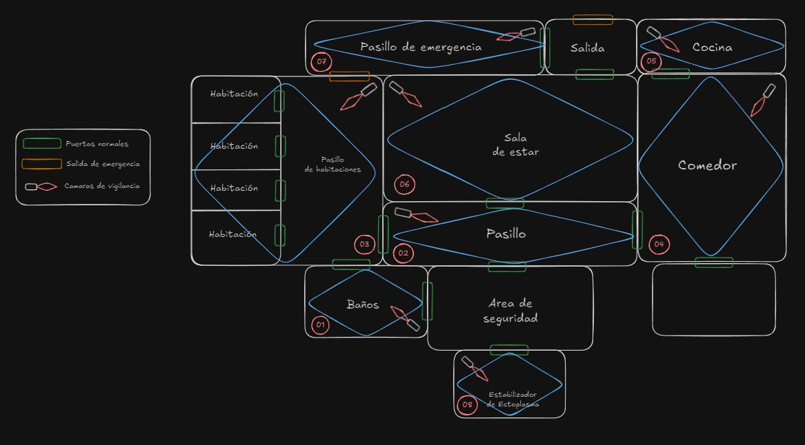
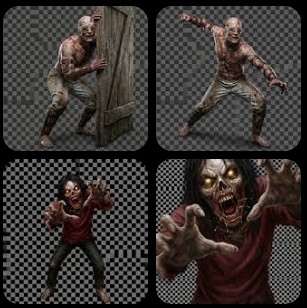

# Ecosistema de COPS

## Herramientas y Ecosistema de Desarrollo en COPS

Hola a todos. En esta cuarta entrega del devlog, quiero hacer una pausa en el diseño narrativo y de UI para hablar de los cimientos: **las herramientas y tecnologías** que están permitiendo que *Contención: Psiquiátrico (COPS)* pase de ser una idea a una realidad jugable.

Un desarrollo independiente requiere versatilidad, y la elección del software adecuado es vital para mantener la agilidad sin sacrificar la calidad. Aquí detallo el flujo de trabajo que ha dado vida a este proyecto.

### 1. Obsidian: El Cerebro donde Todo Comenzó

El paso de la imaginación a lo tangible no ocurrió en un motor de juego, sino en **Obsidian**. Esta herramienta ha sido el núcleo central del juego:

*   **Excalidraw para Prototipado**: Antes de escribir una sola línea de código, utilicé la subherramienta Excalidraw para realizar bocetos rápidos y diseños de prototipado. Aquí definí visualmente cómo se verían las pantallas y dónde se ubicarían los elementos del HUD.

    

*   **Gestión de Tareas y Lore**: Obsidian me ha permitido interconectar toda la historia del psiquiátrico con las tareas técnicas pendientes, manteniendo una wiki de desarrollo siempre accesible.

    

### 2. Gemini: La Generación de Assets Críticos

Una vez definido el esquema en Obsidian, el siguiente paso fue dar vida visual a las amenazas y el entorno utilizando **Gemini**. Esta IA ha sido fundamental para:

*   **Creación de Entidades y Herramientas**: Gemini generó la base visual de los enemigos que acechan, así como los assets detallados del equipo del jugador, como el medidor **EMF** y la **Caja Espectral**.
*   **Diseño de Escenarios**: La generación de las áreas críticas del psiquiátrico permitió establecer el tono visual desde las primeras etapas.

    

### 3. Filmora y Canvas: Refinando el Horror

Con los assets base generados por la IA, el siguiente paso fue el pulido artesanal. Aquí es donde **Filmora** y **Canvas** entraron en juego para los retoques finales:

*   **Canvas para Retoque Visual**: Utilicé Canvas para realizar ediciones básicas y ajustes en los assets creados con Gemini, asegurando que cada imagen tuviera la coherencia visual necesaria para el juego.
*   **Filmora para el Paisaje Sonoro**: El audio es el 50% de la experiencia. Con Filmora, edité y refiné los efectos de sonido (SFX) y los ambientes de tensión, adaptando sonidos de uso libre para que encajaran en la atmósfera opresiva.

### 4. El Núcleo Técnico: HTML, CSS, JS y Electron

Finalmente, el corazón que bombea sangre a todo el sistema es el stack web moderno.

*   **HTML y CSS**: Son los responsables de la estructura y de la atmósfera visual. Gracias a filtros avanzados, capas de ruido y efectos de post-procesado (scanlines), logramos esa estética de monitor CRT que refuerza la inmersión diegética.
*   **JavaScript**: Maneja toda la lógica del juego, desde el sistema de estrés hasta el movimiento de las entidades por el mapa de nodos.
*   **Electron**: Es el puente que convierte una aplicación web en una experiencia de escritorio nativa, permitiéndonos controlar ventanas y procesos del sistema con el rendimiento necesario.

### Mirando hacia adelante

Conocer las herramientas nos ayuda a entender los límites y las posibilidades de lo que estamos creando. Con este arsenal, el camino hacia la versión final fue cada vez más claro.

Gracias por leer este devlog.
