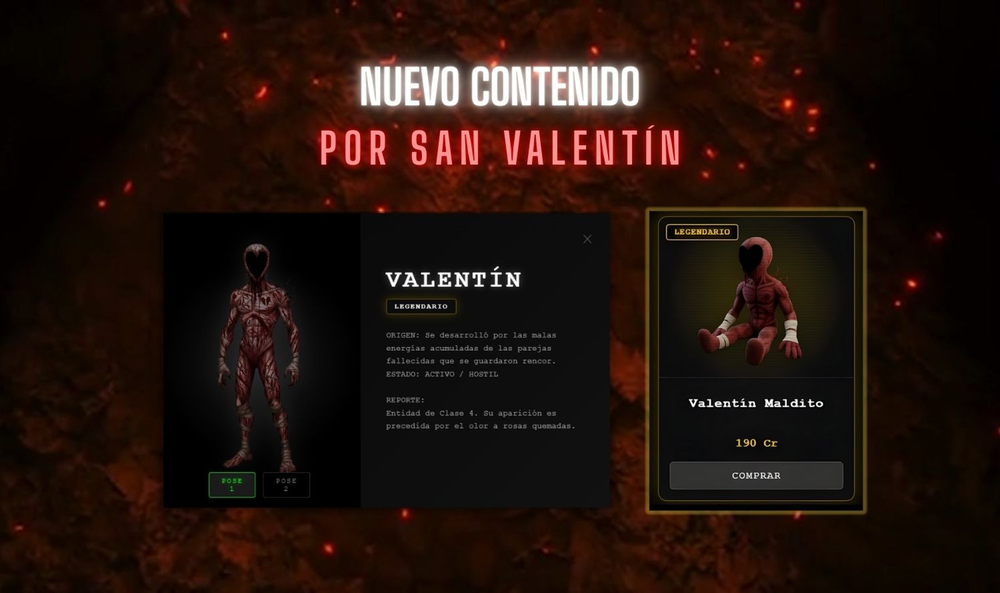
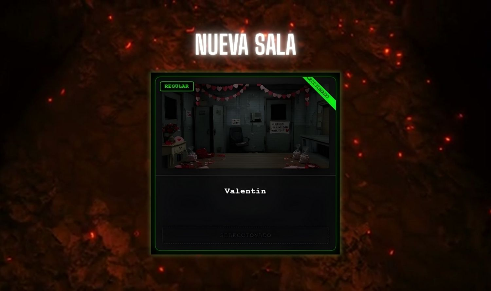

# 🛠️ Actualización Oficial AP001

## 🔦 Sistema de Luz UV Reinventado

Hemos rediseñado por completo la mecánica de la **Luz UV**. Ahora los investigadores disponen de una linterna con apuntado manual que otorga un control total sobre el entorno.
*   **Apuntado Libre**: Dirige el haz de luz UV con precisión usando el ratón.
*   **Efecto Visual Mejorado**: Nuevo efecto de linterna diegético para una mayor inmersión.
*   **Detección Dinámica**: El ente ahora reaccionan solo cuando el haz de luz impacta directamente sobre ellos.

    

        
<b>Antes</b>

        
    

    

        
<b>Después</b>

        
    

Todo el sistema anterior aplica unicamente para el HUD principal del guardia (oficina), el resto de HUDs no se ven afectados (monitores/camaras).

### 👻 Estabilización de la IA del Espectro

Se ha corregido un error crítico que afectaba el comportamiento del ente en todas las noches.
*   **Corrección del "Bucle Doble"**: Se eliminó un fallo que duplicaba la agresividad del fantasma tras ser repelido.
*   **Movimiento Consistente**: El sistema de IA ahora es más estable y justo, respetando los tiempos de aturdimiento y regeneración en todas las dificultades.
*   **Optimización General**: La simulación del fantasma ahora consume menos recursos y es más fiable.

### 💖 Actualización Especial: San Valentín

Se ha añadido contenido temático exclusivo para celebrar la temporada de la "Friend Zone".
*   **Nuevo Espectro: Valentín (ID: fantasma10)**: Un nuevo ente legendario que acecha el psiquiátrico. Con su llegada, el límite de Ectoplasma (EC) se ha incrementado de 14 a 17 y su pieza coleccionable "Valentín Maldito" disponible en la tienda.

*   **Nueva Sala: Valentín**: Cambia la estética de tu oficina con esta nueva skin temática.

