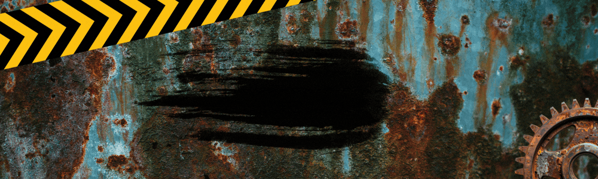
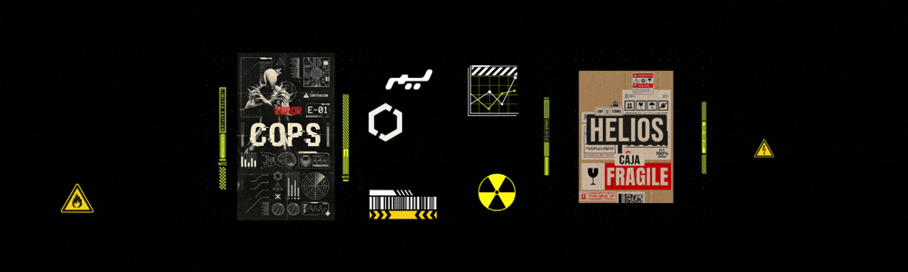

# 🛠️ Actualización Oficial AP003

## 🎨 Equipo de Investigación: Protocolos de Personalización

Me complace anunciar la llegada del programa de **Skins para Herramientas**. Esta actualización expande las capacidades estéticas de tu equipo básico, permitiendo a los investigadores portar tecnología adaptada a sus preferencias personales.

### 🛠️ Nuevas Apariencias para Herramientas
Hemos implementado una serie de modificaciones visuales para tu equipo de campo. Estos cambios se activan de forma automática durante los protocolos de desafío:
Las skins son basadas en desafíos y skins creadas en otras secciones como:

- **Escasez**: Estética desgastada que evoca la precariedad del desafío homónimo; incluye detalles de cinta aislante, acumulación de polvo y erosión industrial.

- **Pink**: Diseño vibrante inspirado en el estilo de la sala "Chava", ideal para personal de seguridad que busca un toque de distinción y elegancia en el equipo.

- **demoniaco**: Inspirado en el desafío Venganza; presenta grabados de símbolos arcanos, emanación de chispas/fuego y texturas que emulan la fisiología de entidades demoníacas.

- **cyberdeck**: Basada en la tecnología de vanguardia del Centro Helios (canon del Lore); integra interfaces visuales avanzadas y una estética de hardware modular.

### 🏪 Optimización de la Tienda de Suministros
El centro de adquisiciones ha sido reconstruido para mejorar la eficiencia táctica de los guardias:
*   **Navegación Vertical (Sidebar)**: Un nuevo sistema de pestañas laterales permite alternar rápidamente entre Peluches, Salas, Herramientas y Fantasmas.
*   **Protocolo de Zoom Expandido**: Ahora es posible realizar una inspección detallada (Zoom) de todas las categorías de objetos, incluyendo salas y peluches.

### 💰 Reequilibrio Económico: Materiales de Contención (MC)
Para incentivar la participación en los escenarios más hostiles, hemos liberado el límite de ganancias en el **Modo Pesadilla**:
*   **Suministro Continuo**: Tras las primeras 6 victorias (500 MC c/u), los investigadores seguirán recibiendo una recompensa de **300 MC** por cada turno completado con éxito.

### ⚙️ Mejoras en la Infraestructura Acústica
Se ha realizado un ajuste en el hardware del detector para reducir la fatiga auditiva durante las guardias prolongadas:
*   **Atenuación del EMF**: El volumen de salida de todas las señales del Detector EMF ha sido reducido al **50%**.

> *Recuerda que las skins de herramientas solo son visibles en los modos de desafío (Pesadilla, Escasez, Venganza y Supervivencia).*

¡Gracias por su continua dedicación a la contención en el ala psiquiátrica! Prepárense, la oscuridad sigue evolucionando.
