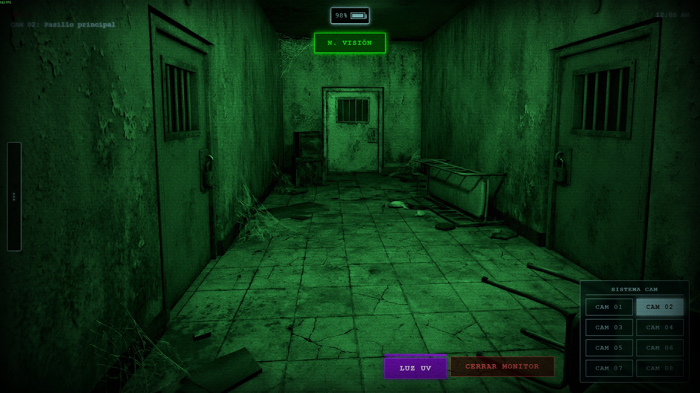
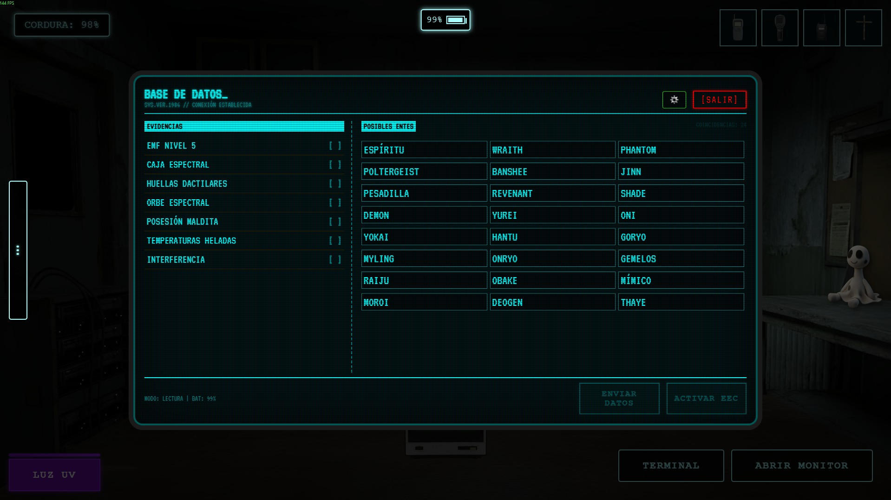

# 🛠️ Actualización Oficial AP004

## 📼 UI/HUD: Mejoras visuales

He desplegado una actualización ligera en el sistema de vigilancia de todas las instalaciones. El objetivo es mejorar la inmersión y la cohesión visual, simulando tecnología de monitoreo analógica de época.

### 📺 Novedades Visuales (CCTV)

Se ha implementado un nuevo **post-procesado visual** para todas las cámaras de seguridad.

*   **Ruido Estático (Static Noise)**: Grano e interferencia visual sutil para dar textura a la imagen.
*   **Distorsión de Lente (Fisheye/Vignette)**: Oscurecimiento perimetral para mimetizar lentes de gran angular de seguridad.

  
  
  

  <input type="range" min="0" max="100" value="50">
  
Anterior

  
Mejorado

La actualización se ha aplicado retroactivamente a todas las noches del modo historia para garantizar una experiencia consistente desde el inicio.

*   **Noches 1 a 7**: Todas las noches ahora cuentan con los nuevos efectos visuales al abrir el monitor.

#### 💀 Modos de Desafío

Los protocolos de seguridad experimental también han recibido esta mejora visual.

*   **Desafío: Escasez**: Implementado.
*   **Desafío: Pesadilla**: Implementado.

> *Nota: El modo "Venganza" permanece con su configuración visual original pero se trabajara en ello en proximas actualizaciones.*

#### ⚙️ Mejoras Técnicas
*   **Activación Dinámica**: Los efectos solo se renderizan cuando el monitor está físicamente abierto ("Flip-up"), optimizando el rendimiento cuando el jugador está en la vista de la oficina.

### 💻 Terminal: "Interfaz de Época"

Se ha rediseñado por completo la terminal de la base de datos de fantasmas para alinearse con la estética. La anterior interfaz moderna ha sido reemplazada por un sistema "retro".

#### 📟 Rediseño Visual (Retro UI)
*   **Estilo CRT**: Fuentes pixeladas, paleta de colores cian/ámbar y bordes curvos de monitor.
*   **Animaciones**: Efecto de encendido y líneas de escaneo.
*   **Distribución**: Nueva organización en 3 columnas para mejor legibilidad reemplazando el anterior de paginado.

  
  
  

  <input type="range" min="0" max="100" value="50">
  
Anterior

  
Mejorado

#### 🚨 Integración con Sistemas de Seguridad
*   **Feedback Visual de Alerta**: Capacidad para mostrar estados críticos (rojo intenso) en situaciones de emergencia.

#### 🌐 Despliegue Global
La actualización se ha aplicado a todos los modos de juego relevantes:
*   **Noches 2 a 7**: Interfaz estandarizada.
*   **Desafíos**: Escasez, Pesadilla y Supervivencia (este último con botón "PURGAR ENTE" adaptado).
