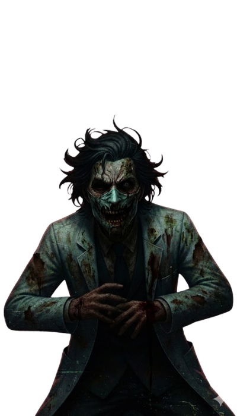
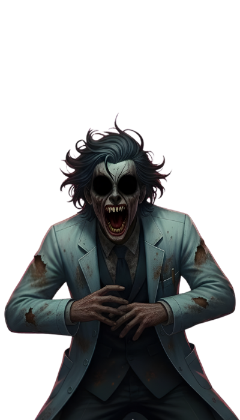
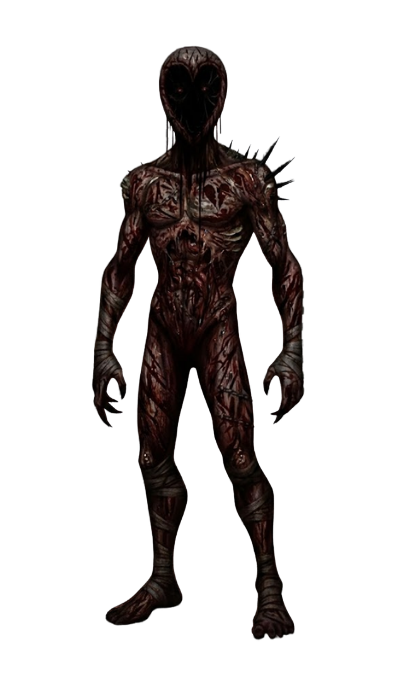
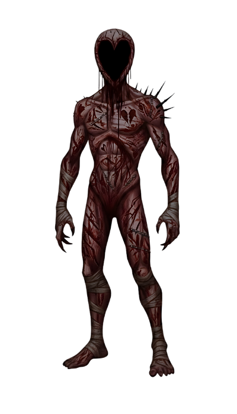

# 🛠️ Actualización Oficial AP005

## 👻 Rediseño de Entidades: Hacia una Presencia Orgánica

He iniciado un proceso de evolución visual para todas las entidades que acechan el psiquiátrico. El objetivo es alejarnos de la estética sintética y perfeccionista de la generación por IA, buscando un horror más crudo, tangible y perturbador.

### 🎨 Refinamiento de Diseño y Texturizado

Los nuevos modelos y texturas de los fantasmas han sido intervenidos con técnicas clásicas de diseño para otorgarles una mayor profundidad y "verdad" visual.

*   **Granularidad y Suciedad**: Se han añadido capas de micro-texturas que simulan deterioro, polvo y materia orgánica, eliminando las superficies excesivamente lisas.
*   **Ruido Visual Dinámico**: Las entidades ahora poseen una capa de ruido estático que las hace sentir inestables, como si su propia existencia estuviera interfiriendo con la realidad.
*   **Aspecto Orgánico**: Hemos suavizado las formas digitales para dar lugar a siluetas más asimétricas y naturales, evocando una sensación de "presencia física" que antes se perdía en la perfección algorítmica.

  
  
  

  <input type="range" min="0" max="100" value="50">
  
Anterior

  
Mejorado

  
  
  

  <input type="range" min="0" max="100" value="50">
  
Anterior

  
Mejorado

> *Este cambio es el primer paso de un rediseño completo de la galería de espectros. Seguiremos trabajando para que cada encuentro sea único y visualmente impactante.*

¡Gracias por su constante feedback! La contención continúa, ahora con una atmósfera más densa que nunca.
