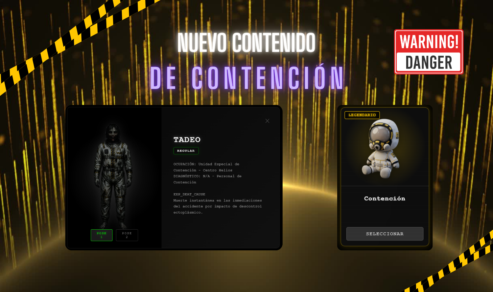
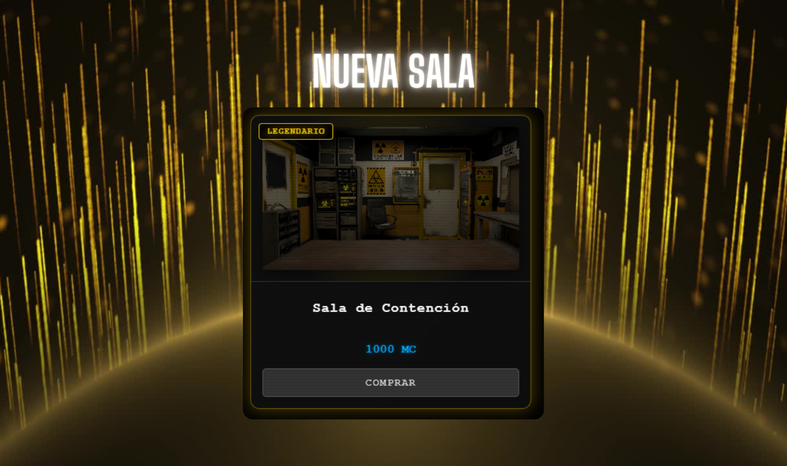

# 🛠️ Actualización Oficial AP007

## 📦 Nuevo Contenido: Set de Contención y Nuevo Fantasma

Esta actualización expande el catálogo de la tienda y los archivos con nuevo contenido equipable con temática de **Contención**, además de sumar una nueva entidad al registro de fantasmas.

### 🛠️ Nuevos Recolores de Herramientas (Serie Contención)

Se han añadido tres nuevas skins temáticas para las herramientas de investigación en la tienda:
* **EMF de Contención**
* **Caja Espectral de Contención**
* **Termómetro de Contención**

### 👻 Nuevo Fantasma: Tadeo Martínez y 🧸 Peluche

* **Categoría**: Regular (1 EC).
* **Historia / Lore**: Integrante de la Unidad Especial de Contención del Centro Helios. Tras el accidente en el sitio de origen, sufrió una muerte instantánea y se manifestó de inmediato como un fantasma de primer plano por la sobrecarga ectoplásmica.

* **Expediente Completo**: Disponible para consultar en el visualizador de expedientes clínicos y en la tienda con su ficha técnica y causa de muerte.
* **Peluche de Contención**: Nuevo amuleto de posesión para la oficina.

### 🏢 Nueva Sala

* **Sala de Contención**: Nueva estética de despacho disponible para adquirir y equipar.

## 🎮 Mapeo Visual de Controles y UX (Resumen)

De forma complementaria, se implementaron insignias retroiluminadas estilo CRT (`[ESPACIO]`, `[Q]`, `[E]`, `[F]`, etc.) en los botones de la sala y en los minijuegos del desafío Venganza para guiarse rápidamente de forma instintiva durante la partida. También se pulió la separación y legibilidad entre botones.

## ⚖️ Ajuste Económico y Rejugabilidad: Sistema de Billetera (Wallet Cap)

Como mejora secundaria de equilibrio, se actualizó la economía del juego para permitir rejugabilidad ilimitada en los modos adicionales:
* **Recompensas Repetibles**: Los desafíos (Escasez, Supervivencia y Venganza) ahora otorgan pagos de forma continua en cada partida completada, removiendo los bloqueos históricos de recompensas únicas.
* **Topes de Capacidad (Wallet Caps)**: Se implementó un límite máximo de retención de fondos simultáneos (**1,200 Cr**, **3,000 MC** y **10 EC**). Al alcanzar el tope, las ganancias adicionales se pausan temporalmente hasta que el jugador invierta sus fondos en la tienda y libere espacio en su billetera.
